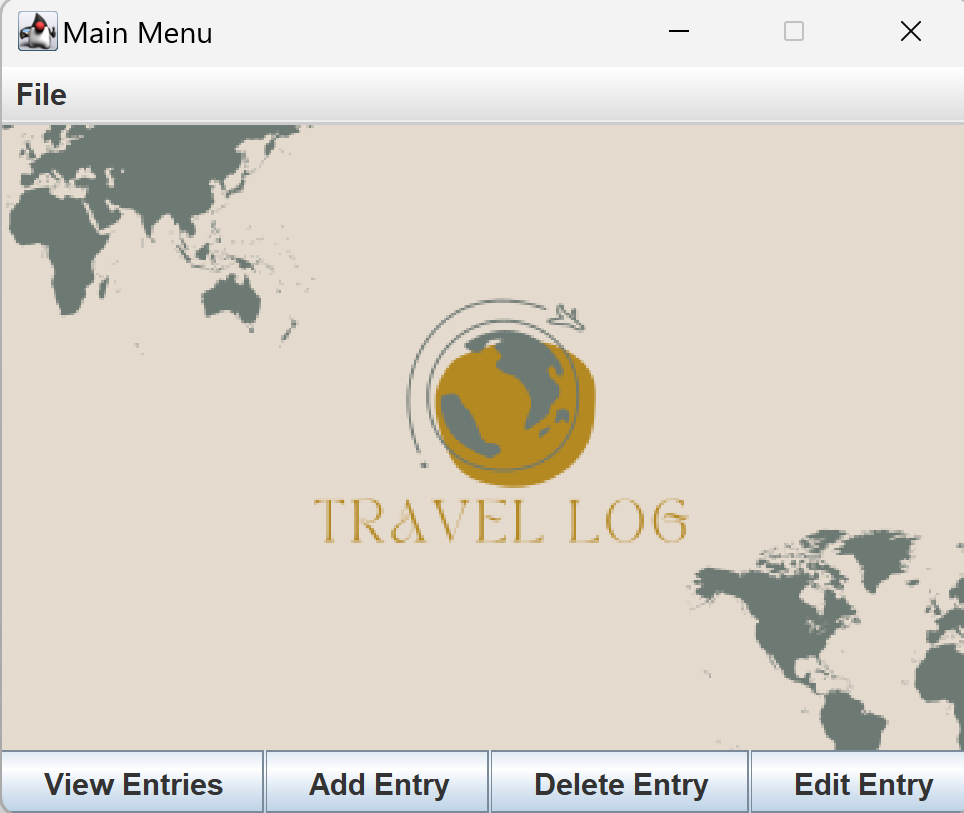

# Travel Journal

### Keep track of your travel dates

---

  

 

**What will the application do?**

- The travel journal application will allow people to record their trips outside Canada or any other country.  
It will be designed in such a way so that individuals will be able to keep track of their travel dates, destinations, and reason for travel. 

**Who will use it?**

- Permanent Residents in Canada. This information is of paramount importance when it comes to applying for a new Permanent Residence card or for Canadian Citizenship, as it is often required to provide a detailed travel history on said application.

**Why is this project of interest to you?**

- This project is of interest to me because I am a Permanent Resident myself and have
gone through the PR renewal application process many times. Although this is something I only have to
do about every 4-5 years, it is a huge time sink and pain to scrape together a detailed, chronological 
travel history for the last 4-5 years. Not only will this project help me the next time I have
to fill out the PR renewal application, hopefully it will also help others in the same position!

---

### User Stories

+ As a user, I want to be able to add a travel entry to my travel journal and specify the departure date, return date, destination, and reason
+ As a user, I want to be able to view a list of travel entries in my travel journal
+ As a user, I want to be able to delete a travel entry from my travel journal
+ As a user, I want to be able to select and edit a travel entry from my travel journal 
+ As a user, I want to be able to save my travel journal to file (if I so choose)
+ As a user, I want to be able to load my travel journal from file (if I so choose)

### Instructions for Grader

+ You can generate the first required action related to the user story "adding multiple Xs to a Y" by clicking the "Add Entry", then filling out the four required text fields (i.e. Departure Date, Return Date, Reason, and Destination), and then clicking the "Add" button.
+ You can generate the second required action related to the user story "editing a travel entry from the journal" by clicking the "Edit Entry," then filling out the 5 required fields (i.e. Departure Date, Return Date, Reason, and Destination, and ID), and then clicking the "Edit" button.
+ You can locate my visual component by launching the Travel Journal application (it's on the Main Menu above the buttons).
+ You can save the state of my application by navigating to the top left of the Main Menu, clicking 'File' and then 'Save'.
+ You can reload the state of my application by navigating to the top left of the Main Menu, clicking 'File' and then 'Load'.

### Examples of Logs

Examples of the events that occur when the program runs. These are printed out after the program terminates.

+ Wed Apr 03 10:51:51 PDT 2024   Entry added to travel journal

+ Wed Apr 03 10:52:15 PDT 2024  Entry added to travel journal

+ Wed Apr 03 10:52:43 PDT 2024   Entry added to travel journal

+ Wed Apr 03 10:52:49 PDT 2024   Journal entries viewed

+ Wed Apr 03 10:53:18 PDT 2024   Entry ID #3 modified

+ Wed Apr 03 10:53:21 PDT 2024   Journal entries viewed

### Thoughts on what I would do differently next time

If I had to refactor the application, I would refactor the Entry class to incorporate the Singleton Design Pattern 
for unique ID generation. I would need to create a separate Singleton class, perhaps named UniqueIdGenerator, which would 
be responsible solely for generating and providing unique IDs. This class would maintain a private static variable that 
holds the last assigned ID and provide a public static method to get the next ID, ensuring thread safety with appropriate 
synchronization mechanisms.

Within the Entry class, instead of generating an ID on object creation, you would call the UniqueIdGenerator.getNextId() method 
to assign a unique ID to each new Entry instance. This ensures that the responsibility of ID generation is encapsulated within 
the UniqueIdGenerator, adhering to the Single Responsibility Principle. The Entry class no longer needs to know about the mechanics of ID 
generation, it just needs to request the next available ID. This separation of concerns not only makes the Entry class cleaner 
but also makes the system more maintainable and less prone to errors related to ID generation, especially in concurrent scenarios 
where multiple Entry instances may be created simultaneously.
